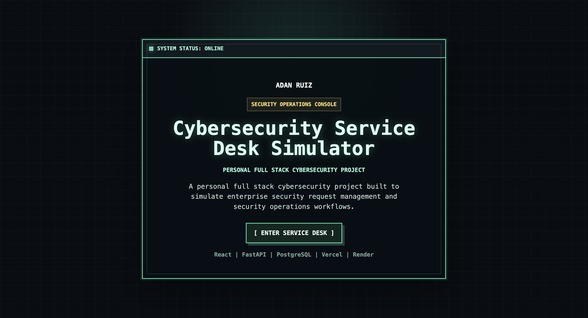
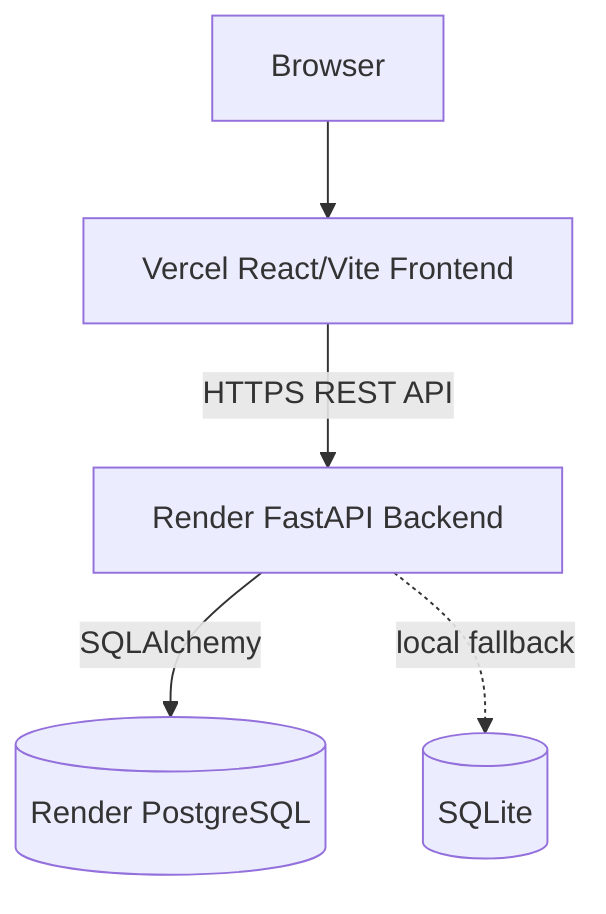
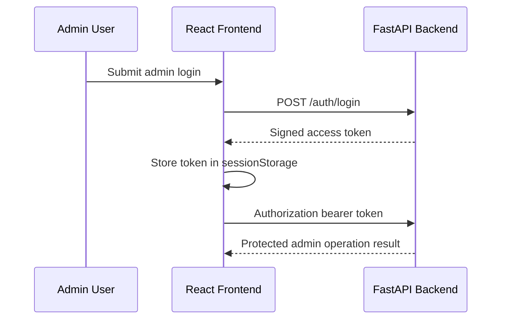

# Cybersecurity Service Desk Simulator

This is a personal full stack personal project that simulates enterprise security request management and service support workflows. It includes ticket intake, automated routing, SLA tracking, analytics, reporting, public demo protections, and an authenticated admin mode.

The project is built as a deployed React/FastAPI application with PostgreSQL persistence. The interface uses a retro visual system while keeping the workflows practical for a service desk or security environment.

AS OF 09/03/26 IT CURRENTLY USES THE FREE EDITION OF RENDER. RENDER SHUTS OFF THE BACK END AFTER 15 MINUTES OF INACTIVITY. THIS MAY CAUSE THE SITE TO INITALLY BOOT UP SLOWLY. THIS WILL BE FIXED VERY SOON AS SOON AS I BUY THE SUBSCRIPTION. THIS IS NOT AN OPTIMIZATION PROBLEM.

## Live Demo

- Live application: https://service-desk-deploy-vert.vercel.app
- Backend API: https://service-desk-deploy.onrender.com
- API docs: https://service-desk-deploy.onrender.com/docs

## Demo Notice

The public deployment includes seeded demonstration records for review. Seeded tickets and knowledge base articles are readable by visitors, but protected from anonymous edits and deletes. Visitors can still create, edit, and delete allowed temporary records for testing.

Admin Mode exists for protected record management, but admin credentials are not published. Secrets and credentials are configured only through backend environment variables.

## Screenshots

The current screenshots are stored in `screenshots/` and reflect the retro  design.

### Landing Page



### Dashboard


### Ticket Queue


### Submit Request


### Knowledge Base


### Reports


## Features

### Ticket Management

- Create, view, update, and delete cybersecurity request tickets
- Generate sequential `SEC-######` ticket numbers
- Search, filter, sort, and paginate the ticket queue
- Track status, priority, assigned team, requester, timestamps, and resolution notes
- View detailed ticket records with protected-demo indicators

### Security Workflow Automation

- Route tickets to a security team based on category
- Assign a default priority based on request type
- Record first-response and resolution timestamps from workflow updates

Example routing:

| Category | Assigned Team |
| --- | --- |
| Phishing | Human Risk Management |
| Password Security | Identity and Access Management |
| Vulnerability | Vulnerability Management |
| Data Loss Prevention | Data Protection |

### Analytics & SLA

- Dashboard metrics for ticket volume and service performance
- Category, status, priority, trend, and SLA analytics
- First response SLA status: `Met`, `Breached`, or `Pending`
- SLA compliance summary and per-priority breakdown

SLA targets:

| Priority | First Response Target |
| --- | --- |
| Critical | 60 minutes |
| High | 240 minutes |
| Medium | 480 minutes |
| Low | 1440 minutes |

### Knowledge Base

- Browse and search cybersecurity guidance articles
- Filter articles by category
- Create, edit, and delete allowed temporary articles
- Protect seeded public-demo articles from anonymous edits and deletes

### Reporting

- Export tickets to CSV
- Filter reports by status, category, priority, assigned team, department, and date range
- Download reports through the backend `/reports/tickets.csv` endpoint

### Demo & Administration

- Public demo mode protects seeded records while keeping the app interactive
- Single-admin authentication uses signed bearer tokens
- The frontend stores admin tokens in `sessionStorage`
- Admin Mode allows authorized management of protected demo records

## Tech Stack

### Frontend

- React
- Vite
- JavaScript
- React Router
- Recharts
- CSS

### Backend

- Python
- FastAPI
- Uvicorn
- SQLAlchemy
- Pydantic

### Database

- PostgreSQL in production
- SQLite local fallback when `DATABASE_URL` is not set

### Deployment & Tools

- Vercel frontend deployment
- Render FastAPI Web Service
- Render PostgreSQL
- Git and GitHub
- REST API
- CSV reporting

## Architecture



Admin authentication flow:



## Ticket Lifecycle

```text
Employee submits request
-> Backend generates ticket number
-> Backend assigns category-driven priority and team
-> Ticket enters the queue as New
-> Analyst or admin updates progress
-> First-response and resolution timestamps are recorded
-> SLA, analytics, and reports reflect the updated state
```

## API Overview

FastAPI exposes interactive documentation at `/docs` and `/redoc`.

| Group | Purpose |
| --- | --- |
| `/health` | API and database health check |
| `/tickets` | Ticket CRUD, search, filters, sorting, and pagination |
| `/analytics` | Dashboard metrics, trends, status, priority, category, and SLA analytics |
| `/knowledge` | Knowledge-base article CRUD, search, and filtering |
| `/reports` | CSV ticket report export |
| `/auth` | Admin login and current admin-session status |

Example API requests:

```text
GET /tickets?status=New
GET /tickets?search=phishing
GET /tickets?sort_by=ticket_number&sort_order=asc
GET /tickets?page=2&page_size=10
GET /analytics/trends?days=30
GET /knowledge?category=Phishing
GET /reports/tickets.csv?priority=High
```

## Local Development

### Backend

From the repository root:

```bash
python3 -m venv .venv
source .venv/bin/activate
pip install -r backend/requirements.txt
uvicorn backend.main:app --reload
```

The backend runs at:

```text
http://127.0.0.1:8000
```

### Frontend

From the repository root:

```bash
cd frontend
npm install
npm run dev
```

The frontend runs at:

```text
http://127.0.0.1:5173
```

### Optional Seed Data

After activating the backend virtual environment, seed the configured database with fictional demo records:

```bash
python -m backend.seed
```

When `DATABASE_URL` is unset, this uses the local SQLite fallback. When `DATABASE_URL` points to PostgreSQL, the same command targets that configured database. Do not reseed the production database unless that is the intended operation.

## Environment Variables

Safe example files are provided at `.env.example` and `frontend/.env.example`.

### Backend

| Variable | Purpose |
| --- | --- |
| `DATABASE_URL` | Optional database connection URL; defaults to local SQLite when unset |
| `FRONTEND_URL` | Optional deployed frontend origin for CORS |
| `DEMO_MODE` | Enables public demo protections when set to `true` |
| `DEMO_MAX_EXTRA_TICKETS` | Limits extra non-seeded tickets in demo mode |
| `DEMO_MAX_EXTRA_KNOWLEDGE_ARTICLES` | Limits extra non-seeded knowledge articles in demo mode |
| `ADMIN_USERNAME` | Single admin username |
| `ADMIN_PASSWORD_HASH` | Bcrypt hash for the admin password |
| `ADMIN_TOKEN_SECRET` | Secret used to sign admin access tokens |
| `ADMIN_TOKEN_EXPIRE_MINUTES` | Admin token lifetime in minutes |

### Frontend

| Variable | Purpose |
| --- | --- |
| `VITE_API_BASE_URL` | Backend API base URL used by the React app |

Do not commit real `.env` files, database URLs, token secrets, password hashes, or credentials.

## Security & Demo Safety

This is a portfolio application, not a production security product. The public demo uses seeded fictional data and protects seeded demo records from anonymous edits and deletes. Admin authentication uses signed bearer tokens, and the frontend stores the token in `sessionStorage` for the current browser session.

Backend authorization checks are responsible for protected operations. Secrets are provided through environment variables and should not appear in frontend source, screenshots, commits, or documentation.

## Deployment

Current deployment:

| Layer | Platform |
| --- | --- |
| Frontend | Vercel |
| Backend | Render Web Service |
| Database | Render PostgreSQL |

The Vercel frontend calls the Render FastAPI backend over HTTPS. The backend connects to Render PostgreSQL through SQLAlchemy. Local development can run against SQLite without requiring a cloud database.

## Project Structure

```text
backend/
  main.py              FastAPI app setup, CORS, health check, router registration
  database.py          SQLAlchemy engine/session configuration
  routes/              Ticket, analytics, knowledge, report, and auth routes
  ticket_logic.py      Ticket numbering, routing, priority, and timestamps
  sla.py               First-response SLA evaluation
  analytics.py         Dashboard metric calculations
  reports.py           CSV generation
  seed.py              Fictional demo ticket seed data

frontend/
  src/
    components/        Shared layout, cards, charts, and badges
    pages/             Route-level React pages
    services/api.js    API client and admin token handling
    styles.css         Retro cyber-operations visual system
  package.json         Vite scripts and frontend dependencies
  vercel.json          SPA route rewrites for Vercel

screenshots/           Current project screenshots
README.md
.env.example
```

## Portfolio Context

This project demonstrates full stack application development, REST API design, relational data modeling, deployment configuration, frontend state management, analytics visualization, CSV reporting, and security oriented workflow design.
