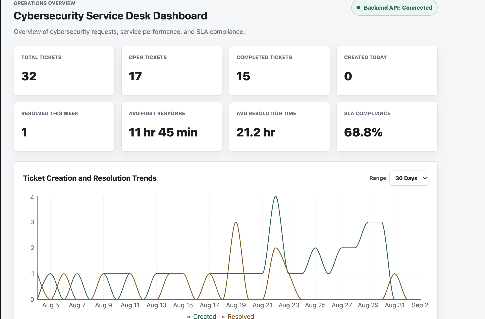
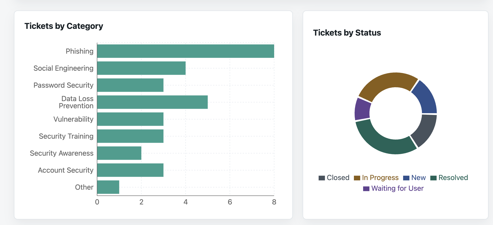
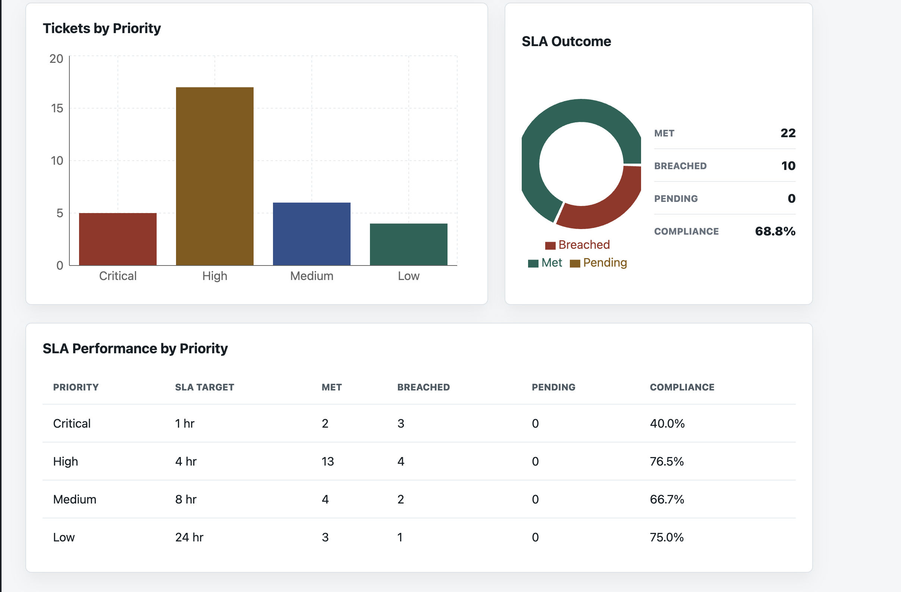
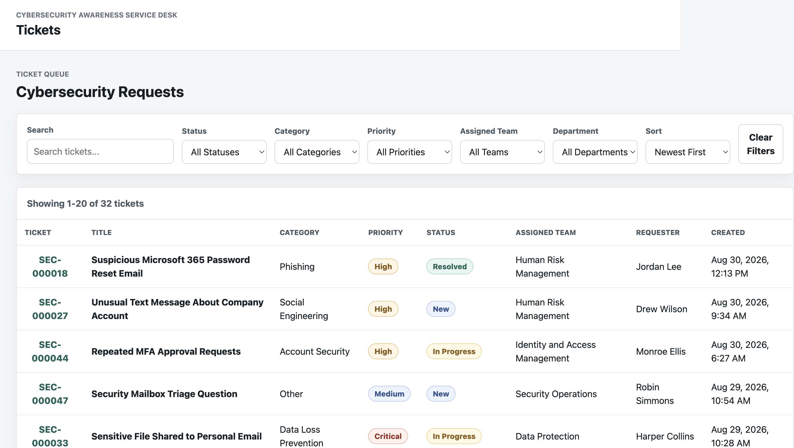
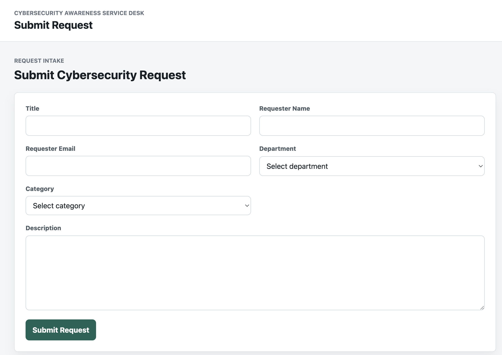
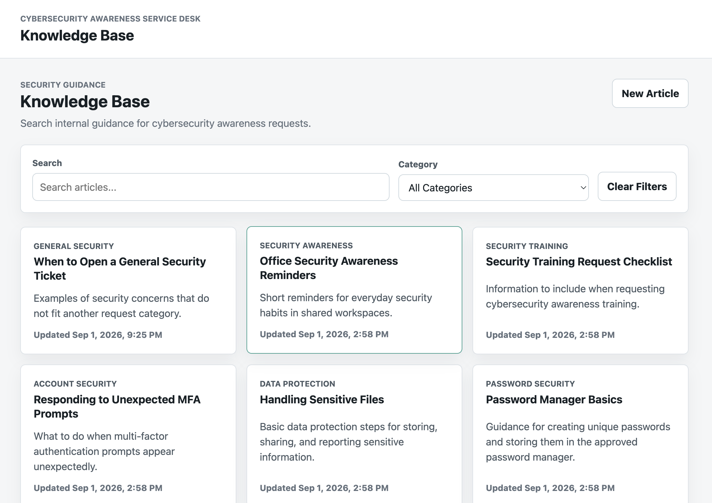
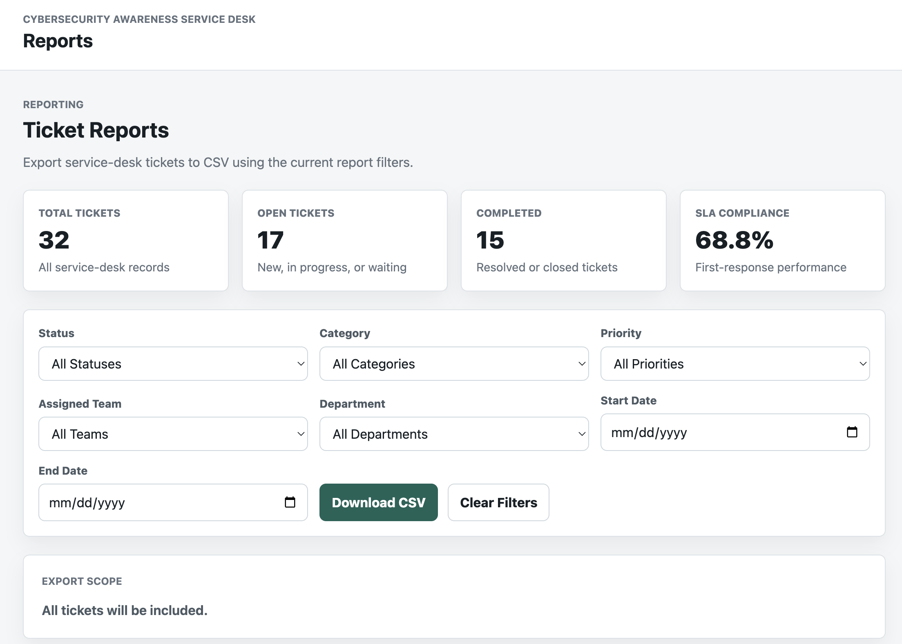

# Cybersecurity Awareness Service Desk

Cybersecurity Awareness Service Desk is a portfolio project that simulates an enterprise cybersecurity awareness and service desk request management system. Employees can submit cybersecurity requests, while analysts can triage, manage, resolve, measure, and report on tickets.

The application is designed as a full local demo with a React frontend, a FastAPI REST API, and a SQLite development database.

## Features

### Ticket Management

- Submit cybersecurity awareness and security support requests
- Generate sequential ticket numbers automatically
- Route tickets to the correct security team based on category
- Assign default priority based on category
- Search, filter, sort, and paginate the ticket queue
- Update ticket status, priority, assigned team, and resolution notes
- Delete tickets with confirmation

### Service Management

- Track first response time automatically
- Track resolution time automatically
- Evaluate first response SLA status
- Report SLA compliance overall and by priority

### Analytics

- KPI dashboard for ticket volume and service performance
- Ticket counts by category, status, and priority
- Created vs. resolved trend chart
- SLA outcome dashboard
- SLA performance table by priority

### Knowledge Base

- Store cybersecurity guidance articles
- Browse articles by title, summary, category, and update date
- Search article title, summary, and content
- Filter articles by category
- View article detail pages
- Create, edit, and delete articles

### Reporting

- Export tickets to CSV
- Filter CSV exports by status, category, priority, assigned team, department, and created date range
- Include clean headers, readable timestamps, and blank values for nullable fields

## Tech Stack

### Backend

- Python
- FastAPI
- Uvicorn
- SQLAlchemy
- SQLite
- Pydantic

### Frontend

- JavaScript
- React
- Vite
- React Router
- Recharts
- CSS

### Other

- REST API
- CSV reporting
- Git and GitHub

## Architecture

The project uses a simple full stack architecture:

```text
React frontend
-> REST API requests
-> FastAPI routes
-> CRUD, ticket workflow, analytics, SLA, and reporting logic
-> SQLAlchemy models and sessions
-> SQLite database
```

The frontend is responsible for presentation, navigation, forms, and user interaction. Backend routes handle HTTP request and response behavior. Ticket workflow logic, SLA evaluation, analytics calculations, CSV generation, and database operations are kept in backend modules instead of being duplicated in React.

## Ticket Workflow

```text
Employee submits request
-> Ticket number is generated
-> Category determines assigned team
-> Category determines default priority
-> Ticket starts as New
-> Analyst starts work
-> First response timestamp is recorded
-> Analyst updates priority or team if needed
-> Analyst resolves ticket
-> Resolution timestamp and notes are stored
-> SLA, analytics, and reports reflect the ticket state
```

## SLA Rules

SLA tracking measures first response time, not total resolution time.

| Priority | First Response Target |
| --- | --- |
| Critical | 1 hour |
| High | 4 hours |
| Medium | 8 hours |
| Low | 24 hours |

Pending tickets are excluded from SLA compliance percentage calculations. Compliance is calculated as:

```text
Met / (Met + Breached) * 100
```

## Project Structure

```text
backend/
  main.py              FastAPI application setup and router registration
  database.py          SQLAlchemy engine, session, and Base configuration
  models.py            SQLAlchemy database models
  schemas.py           Pydantic request and response schemas
  enums.py             Shared enum values
  crud.py              Ticket database operations
  knowledge_crud.py    Knowledge-base database operations
  ticket_logic.py      Ticket numbering, routing, priority, and timestamp logic
  sla.py               SLA targets and evaluation helpers
  analytics.py         Dashboard analytics calculations
  reports.py           CSV report generation
  seed.py              Development seed entry point
  knowledge_seed.py    Knowledge base seed data
  routes/              FastAPI route modules

frontend/
  src/
    components/        Shared React UI components
    constants/         Shared frontend option lists
    pages/             Route level React pages
    services/          API client functions
    utils/             Formatting helpers
    App.jsx            React Router configuration
    main.jsx           React entry point
    styles.css         Application styles
  .env.example         Example frontend API URL
  package.json         Frontend scripts and dependencies
  package-lock.json    Locked frontend dependency versions
  vite.config.js       Vite configuration
```

## Backend Setup

From the repository root:

```bash
python3 -m venv .venv
source .venv/bin/activate
pip install -r backend/requirements.txt
uvicorn backend.main:app --reload
```

The API runs at:

```text
http://127.0.0.1:8000
```

## Frontend Setup

From the repository root:

```bash
cd frontend
npm install
npm run dev
```

The frontend development server runs at:

```text
http://127.0.0.1:5173
```

## Environment Variables

The frontend uses one optional environment variable:

```text
VITE_API_BASE_URL=http://127.0.0.1:8000
```

An example file is provided at:

```text
frontend/.env.example
```

For local development, the frontend falls back to `http://127.0.0.1:8000` when `VITE_API_BASE_URL` is not set. Do not commit real secrets in `.env` files.

## Development Seed Data

After activating the Python virtual environment, populate the local SQLite database with fictional tickets and knowledge base articles:

```bash
python -m backend.seed
```

The seed operation is designed for local development and demo use. It skips duplicate ticket seed data and inserts only missing knowledge-base articles. Demo tickets use fictional names and `example.com` email addresses.

## API Documentation

After starting the backend, open:

- http://127.0.0.1:8000/docs
- http://127.0.0.1:8000/redoc

## API Endpoints

### Health

| Method | Endpoint | Purpose |
| --- | --- | --- |
| GET | `/health` | Check API and database connectivity |

### Tickets

| Method | Endpoint | Purpose |
| --- | --- | --- |
| POST | `/tickets` | Create a ticket |
| GET | `/tickets` | List tickets with search, filters, sorting, and pagination |
| GET | `/tickets/{ticket_id}` | Retrieve one ticket |
| PATCH | `/tickets/{ticket_id}` | Update ticket workflow fields |
| DELETE | `/tickets/{ticket_id}` | Delete a ticket |

### Analytics

| Method | Endpoint | Purpose |
| --- | --- | --- |
| GET | `/analytics/summary` | Dashboard KPI and SLA summary |
| GET | `/analytics/categories` | Ticket counts by category |
| GET | `/analytics/status` | Ticket counts by status |
| GET | `/analytics/priorities` | Ticket counts by priority |
| GET | `/analytics/trends` | Created and resolved ticket trends |
| GET | `/analytics/sla` | Overall and per priority SLA performance |

### Knowledge Base

| Method | Endpoint | Purpose |
| --- | --- | --- |
| POST | `/knowledge` | Create a knowledge base article |
| GET | `/knowledge` | List articles with search and category filtering |
| GET | `/knowledge/{article_id}` | Retrieve one article |
| PATCH | `/knowledge/{article_id}` | Update an article |
| DELETE | `/knowledge/{article_id}` | Delete an article |

### Reports

| Method | Endpoint | Purpose |
| --- | --- | --- |
| GET | `/reports/tickets.csv` | Download a filtered ticket CSV report |

## Example API Requests

```text
GET /tickets?status=New
GET /tickets?category=Phishing
GET /tickets?priority=Critical
GET /tickets?department=Finance
GET /tickets?assigned_team=Human Risk Management
GET /tickets?search=Microsoft
GET /tickets?sort_by=ticket_number&sort_order=asc
GET /tickets?page=2&page_size=10
GET /analytics/trends?days=30
GET /knowledge?category=Phishing
GET /knowledge?search=password
GET /reports/tickets.csv?status=Resolved
GET /reports/tickets.csv?start_date=2026-01-01&end_date=2026-01-31
```

## Screenshots


### Dashboard







### Tickets



### Submit Request



### Knowledge Base



### Reports



## Development Notes

- The SQLite database is local development data and is ignored by Git.
- `frontend/node_modules/` and `frontend/dist/` are generated locally and ignored by Git.
- `frontend/package-lock.json` should remain tracked for reproducible frontend installs.
- The project does not implement authentication, user accounts, cloud deployment, ServiceNow integration, AI features, email notifications, or Docker deployment.

## Future Improvements

- Authentication and role based access control
- PostgreSQL for production style database usage
- Docker/container deployment
- Email or Microsoft Teams notifications
- Ticket audit history
- ServiceNow integration
- AI assisted ticket classification or summarization
- Cloud deployment
